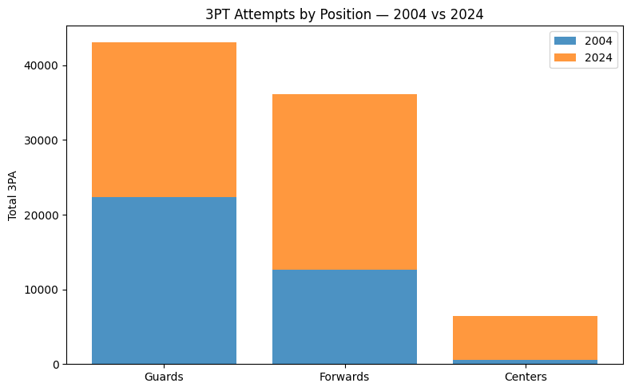
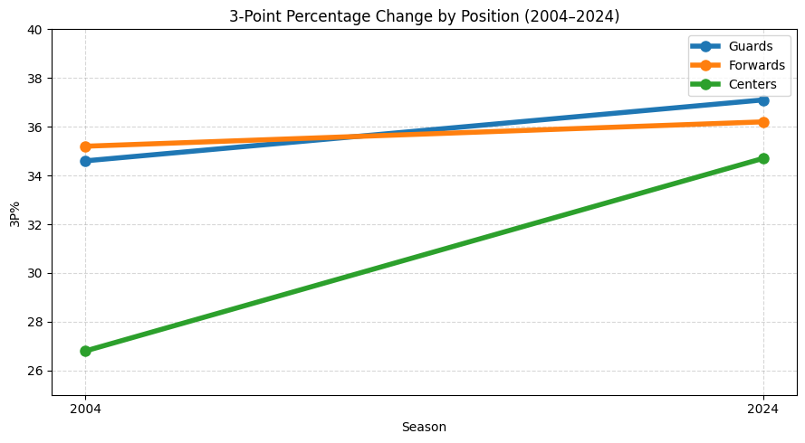
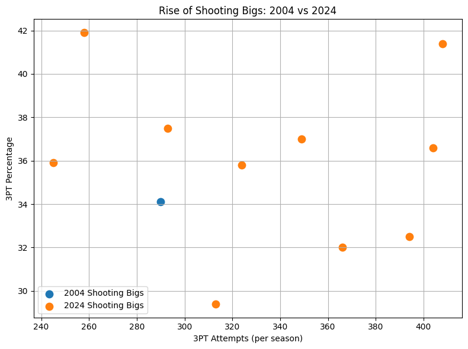

# How Steph Curry Changed NBA Shot Selection: A Data Comparison Between 2004 and 2024

The NBA has undergone one of the most dramatic evolutions in sports history, and the shift is most visible behind the three-point line. For decades, NBA offenses revolved around post-ups, mid-range jumpers, and physicality inside the arc. But as players like Stephen Curry redefined what was possible from long distance, the meaning of an “efficient shot” changed forever. As someone who grew up watching the change in real time, I wanted to understand this transformation through real data, comparing shots taken by NBA players in 2004 and 2024. By examining differences across positions like guards, wings, and most importantly bigs, we can see how Steph Curry’s influence reshaped not only individual players, but offensive philosophies.

---

## Everybody Shoots Threes Now

The most straightforward way to see the league’s transformation is simply to count how often each position shoots from deep. The modern game didn’t replace old habits; it expanded them outward. The ability to shoot 3s has always been a valuable asset in the league, but it becomes more egregious when every position is at least doubling their attempts from 3.

The scale of the change in league-wide shooting is staggering. Guards are still the main 3-point shooters, but even they nearly doubled their volume. Forwards more than tripled their shots from 3, and centers, who historically avoided threes and stayed in the paint, now take over six thousand attempts per season. This isn’t just teams shooting more for the sake of shooting more. The positional distribution shows a shift in offensive philosophy. The modern NBA expects every player on the court to be able to stretch the floor and force defenders to respect their shot creation. Teams don’t draft centers just because they're big and strong anymore. Unless they’re mobile, they don’t keep forwards unless they can space, and guards are expected to pull from distances that would have gotten them benched twenty years ago.

---

## Volume Shooters from 3 are Common Now
A natural assumption would be that if shot volume skyrocketed, accuracy must have suffered. Naturally only volume shooters are able to keep their accuracy with an increase of attempts. But the opposite happened. When comparing 3-point percentages of each position across the two seasons, the shift becomes clearer. Somehow every position improved at efficiency from 3, despite a heavily multiplying production from 3.

Every position improved. Guards now shoot threes nearly 3% better than their 2004 counterparts, which doesn't sound like much, but that's 9 more points every 100 shots. Forwards nudged upward as well. The most dramatic leap came from centers, who improved from 26.8% to 34.7%, essentially becoming competent long-range threats across the league. The position intended for simply being a big man in the paint to get in the way and stuff dunks is now pulling up from 26 feet, and teams expect that now. This raises an important point; the NBA didn’t just start shooting more threes, it got better at taking them. Teams optimized spacing and training in all of their players to turn what used to be a risk into the most efficient scoring pathway in the sport. After all, 3 points is more than 2. Systems evolved around the idea that the best shot is often the one farthest from the basket, especially if it rearranges the defense. Far from degrading shot quality, the expansion of quantity of long range shooting increased it.

---

## The Rise of the Shooting Big
If any group represents the league’s transformation, it’s centers and power forwards. In 2004, only one of them attempted more than 50 threes all season, and that just so happens to be who is considered as the greatest shooting big in league history, Dirk Nowiztki. By 2024? Thirty-three. They're so prominent that there's more shooting bigs than there are teams in the NBA. Not only did the population of shooting bigs explode, but their shot profiles shifted dramatically toward the perimeter.

This visualization highlights something that would’ve sounded absurd two decades ago: many of the NBA’s highest volume 3-point shooters are now the two biggest players on the court. Players like Brook Lopez, Kristaps Porziņģis, and Naz Reid are a part of the reshaping of the definition of the position entirely. Instead of posting up play in and play out, modern bigs drift to the corners, pop after screens, and punish defenses that refuse to guard them high.

This transformation didn’t happen in isolation. It was a response to the spacing arms race triggered by the Warriors dynasty, and the gravitational pull of Stephen Curry. Once teams saw how deadly a fully spaced offense could be, weaving in and out of screens to shoot a dagger from behind the arc, the league collectively realized that the old blueprint for centers wasn't completely optimized. If your big couldn't shoot, defenses could simply ignore him and compress the floor. Now, even rookies enter the league with step back threes in their development plans.
---

## Final Thoughts: A League Transformed

Together, these visualizations reveal a sport that has evolved more in twenty years than perhaps any other major league. Stephen Curry is not the sole cause of this transformation, but he is undoubtably the symbol of it. His success from distance forced defenses to stretch, which in turn created an avalanche of ability from players to stretch the floor and force offensive productivity to skyrocket.

What began as one player's extraordinary talent is now a structural part of the NBA. Guards take more threes. Wings shoot with higher efficiency. Bigs space the floor and handle the ball. Players enter the game with the sole purpose to post up from the corner and hit a 3, then leave the court. And young players at all levels train with these trends in mind. Understanding this evolution is more than statistical. It reflects how quickly a sport can reinvent itself when the right skill enters the conversation.

The data makes it unmistakably clear; the NBA of today is playing a completely different game than it was in 2004. And the effects of this transformation will continue shaping basketball for years to come.
